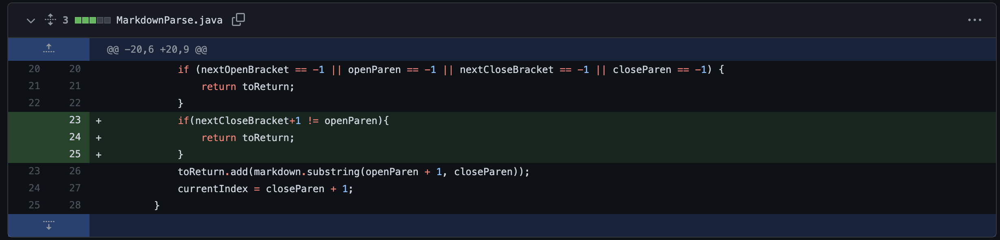

1. Code change 1:

[Link to the test file for a failure-inducing input1:](https://github.com/Yumei0422/markdown-parse/blob/main/file3.md)

Output of the command 
The link in the file is invalid as there space and character between the brackets and parentheses so the correct output should be an empty list. However, the symptom shows that what's in the parentheses is returned so we change the code to check if there's space between the bracket and parentheses to make sure the error is fixed. 

