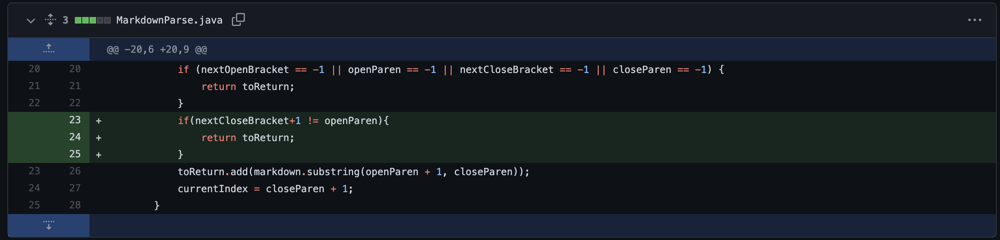
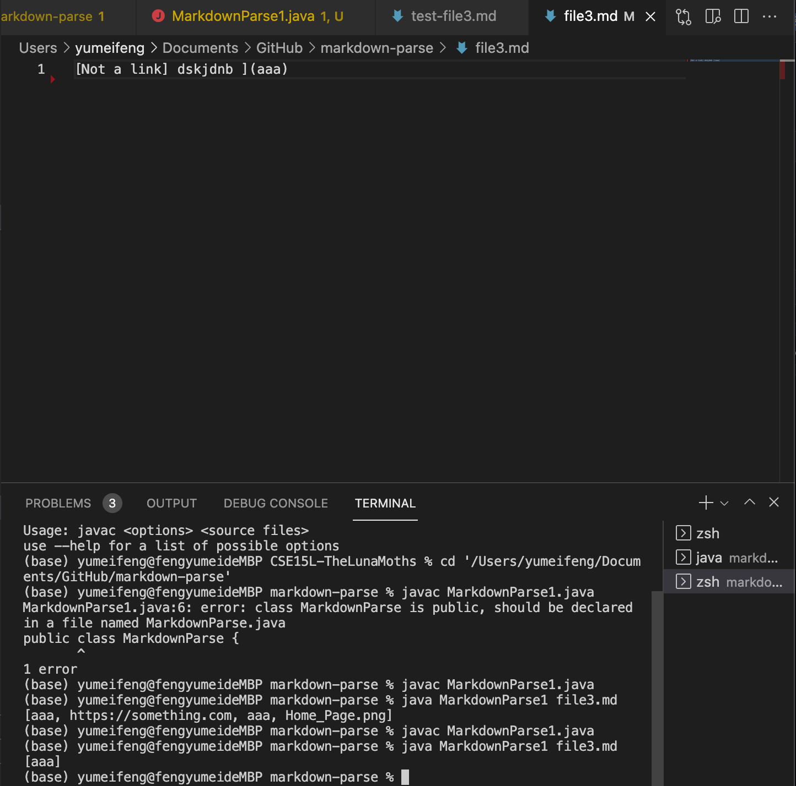
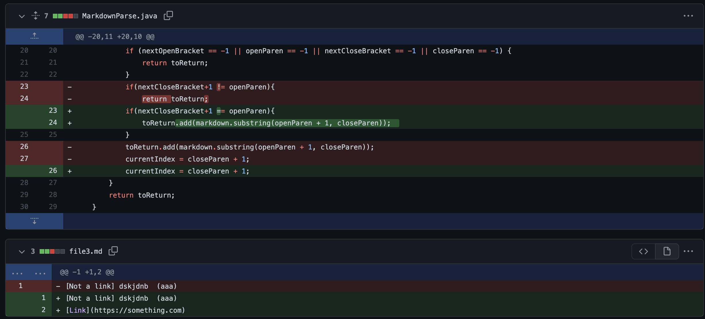
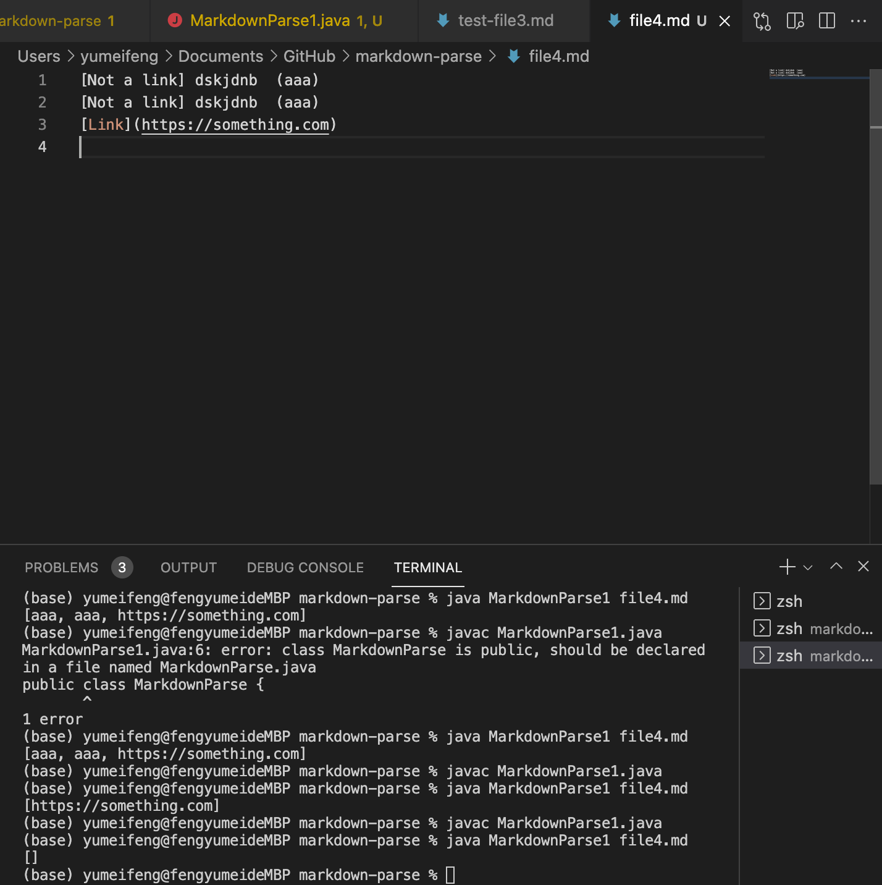
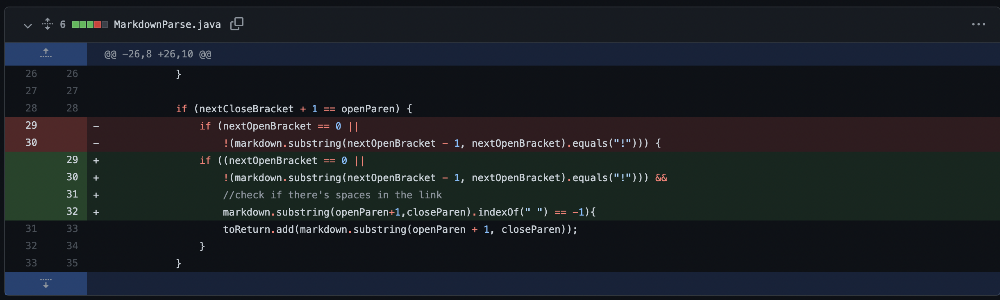
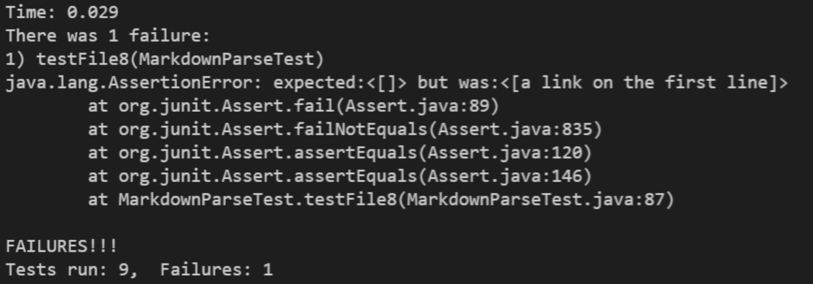

# Lab report 2 
## Code change 1:

[Link to the test file for a failure-inducing input1:](https://github.com/Yumei0422/markdown-parse/blob/main/file3.md)

**Output of the command** 

**Explanation**

The link in the file is invalid as there space and character between the brackets and parentheses so the correct output should be an empty list. However, the symptom shows that what's in the parentheses is returned so we change the code to check if there's space between the bracket and parentheses to make sure the error is fixed. 

## Code change 2:

[Link to the test file for a failure-inducing input2:](https://github.com/Yumei0422/cse15l-lab-reports-2/blob/main/file4.md)

**Output of the command** 

**Explanation**

There's a valid link after two invalid links so the program should print only the valid link. However, the program prints out nothing since the invalid link is in front of the valid links. In order to fix the bug, we fix the code to add valid links to the array instead of just returning an empty array. 

## Code change 3:

[Link to the test file for a failure-inducing input3:](https://github.com/Yumei0422/CSE15L-TheLunaMoths/blob/main/test-file8.md)

**Output of the command** 

**Explanation**

The code fail to identify the invalid link since it fails to check if there's spaces between the links. To fix the bug, we added a new and statement to the if statement to verify that there's no links in between the links. 
